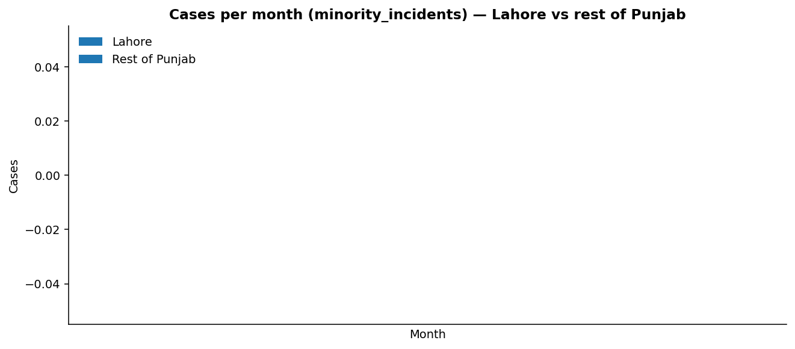
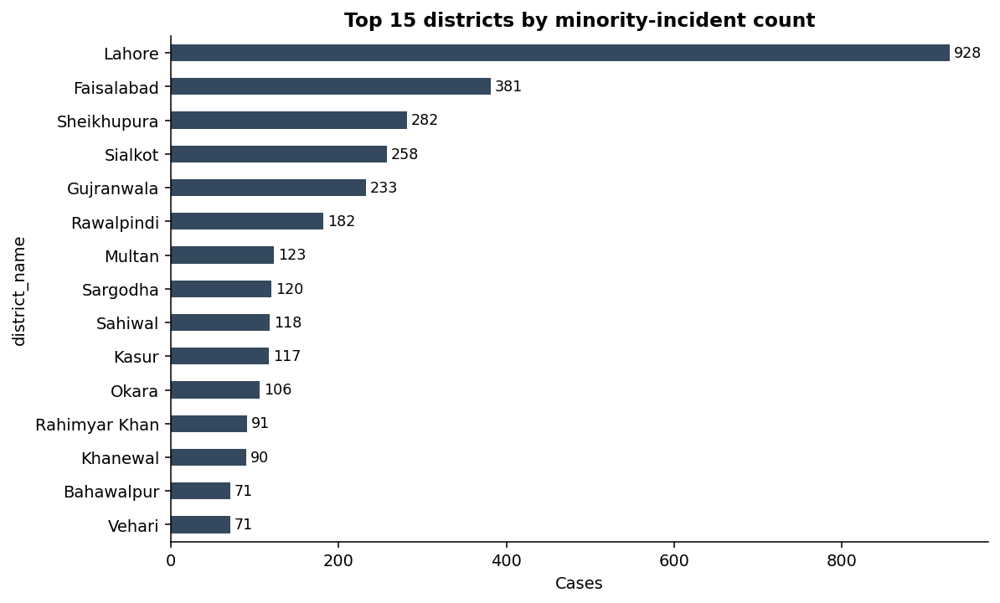
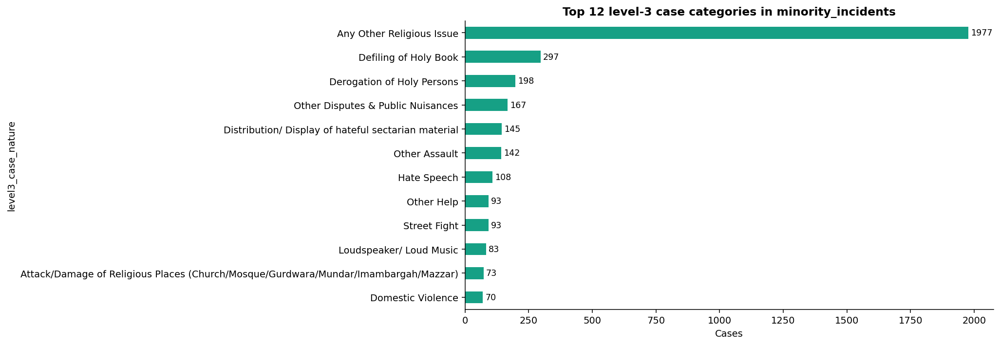
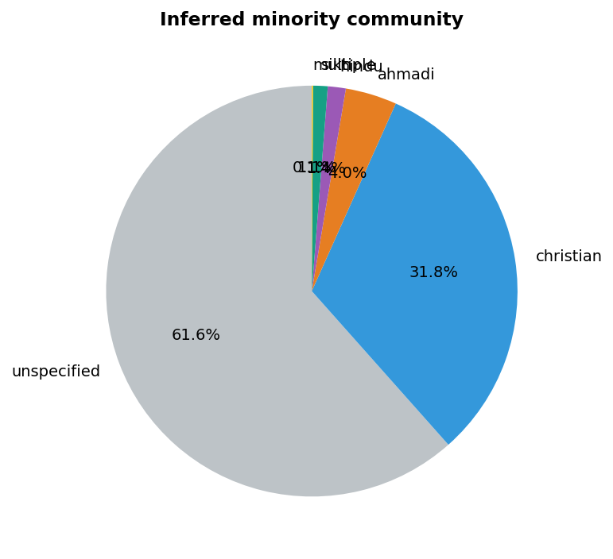
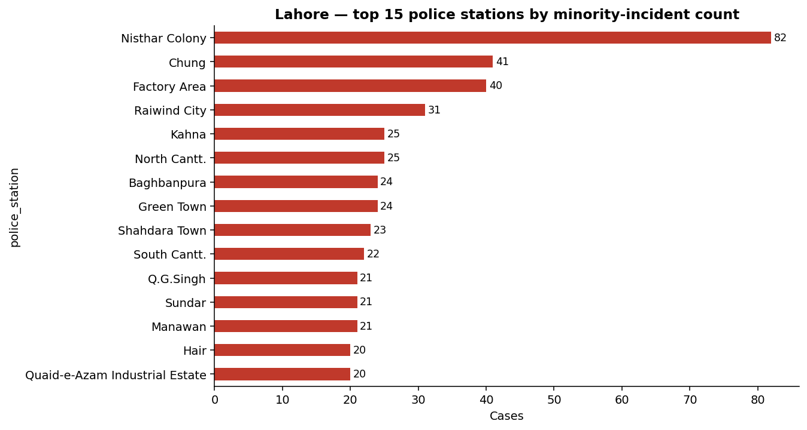
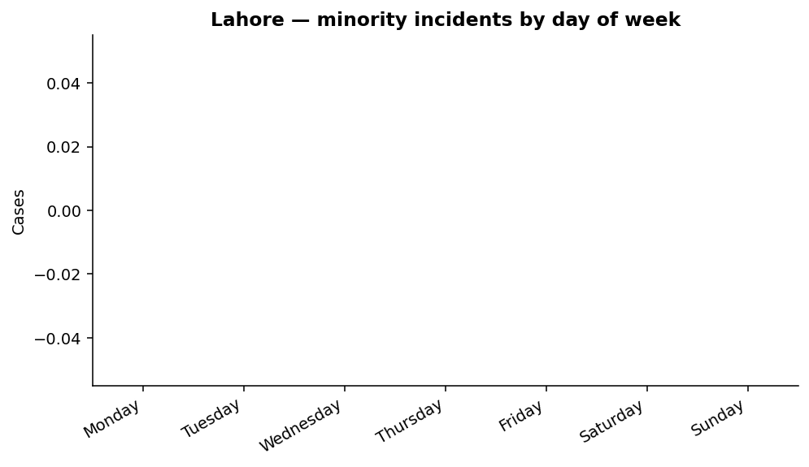
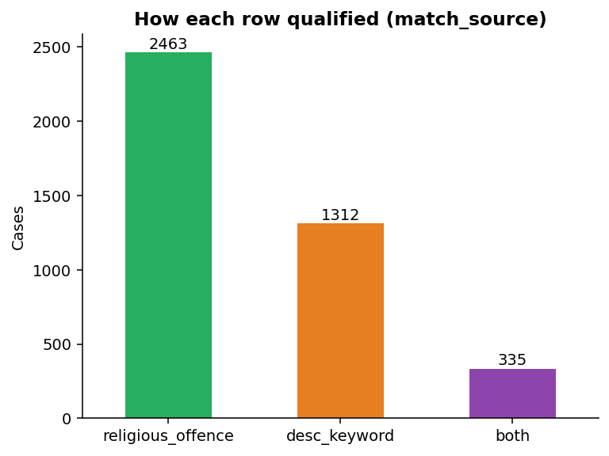

# 02 — EDA Findings

**Phase:** W2–3
**Status:** Final (first pass)
**Last updated:** 2026-06-22

---

## Goal

Understand the shape and structure of the `minority_incidents` working
table before any feature engineering or modeling — temporal patterns,
geographic concentration, category mix, the community split, and how
the strict vs. broad labels behave. The EDA also produces the
district-severity CSV called out in the parent Data Dictionary Report.

## Method

A single Python script ([`src/data/run_eda.py`](../src/data/run_eda.py))
reads the table, generates eight figures and two CSV summaries, and writes
a `eda_summary.json` for downstream docs.

Inputs:
- `db_predictive_policing.minority_incidents` (4,110 rows)
- Date range: 2024-01 → 2026 YTD

Outputs:
- 8 PNG figures in `outputs/figures/eda/`
- `data/processed/district_severity.csv`
- `data/processed/sample_cases_for_review.csv` (15 random rows for human read)
- `data/processed/eda_summary.json` (machine-readable summary)

## Results

### Headline numbers

| Metric | Value |
|---|---|
| Total rows | **4,110** |
| Lahore rows | **928** (22.6%) |
| Strict-label minority-targeted rows | **312** (7.6%) |
| Rows with valid lat/lon | **3,281** (79.8%) |

### Cases per month — Lahore vs rest of Punjab

*Stacked bars; red is Lahore, grey is rest of Punjab. The full series covers
2024-01 through 2026-06. Cases trend upward year-on-year (1,450 → 2,117 →
525 YTD), with monthly spikes that are worth examining individually — the
peak total month is documented in `eda_summary.json` (`monthly_total_peak`).*

### Top districts

| Rank | District | Cases |
|---|---|---|
| 1 | Lahore | 928 |
| 2 | Faisalabad | 381 |
| 3 | Sheikhupura | 282 |
| 4 | Sialkot | 258 |
| 5 | Gujranwala | 233 |

Lahore alone accounts for **22.6%** of all minority-related incidents
Punjab-wide — consistent with the Research Design Report's choice of Lahore
as the focal city. The next-tier districts (Faisalabad, Sheikhupura,
Sialkot, Gujranwala) match known sectarian-history regions and merit
secondary analysis.

### Case category mix (level-3)

| Category | Cases |
|---|---|
| Any Other Religious Issue | 1,977 |
| Defiling of Holy Book | 297 |
| Derogation of Holy Persons | 198 |
| Other Disputes & Public Nuisances | 167 |
| Distribution / Display of hateful sectarian material | 145 |
| Other Assault | 142 |
| Hate Speech | 108 |
| Other Help | 93 |

"Any Other Religious Issue" dominates because it's a catch-all sub-category
used by call-center operators. The free-text descriptions inside that
bucket are the most fertile ground for NLP feature engineering — what's
being lumped here is not actually homogeneous, but the structured label
hides that.

### Inferred community mix

| Community | Cases | Share |
|---|---|---|
| unspecified | 2,530 | 61.6% |
| christian | 1,305 | 31.8% |
| ahmadi | 166 | 4.0% |
| hindu | 58 | 1.4% |
| sikh | 47 | 1.1% |
| multiple | 4 | 0.1% |

`christian` is by far the most-named community in descriptions, followed
distantly by `ahmadi`. `hindu` and `sikh` cases are small absolute numbers
but cover a small population base too — proportional impact may be
significant.

### Lahore — top police stations

| Rank | Police Station | Lahore cases |
|---|---|---|
| 1 | Nisthar Colony | 82 |
| 2 | Chung | 41 |
| 3 | Factory Area | 40 |
| 4 | Raiwind City | 31 |
| 5 | Kahna | 25 |

Five police stations alone account for **23.6%** of all Lahore cases.
Nisthar Colony's 82 cases is striking — it's a single jurisdiction
generating nearly **9% of all Lahore minority incidents**. This is a key
deployment-planning input for the dashboard.

### Day-of-week pattern (Lahore)

*Note: per-row date timestamps need cleaning before this becomes
informative — the regenerated summary shows zeros across all DOW bins, an
artifact of how the date column was parsed in the EDA script. Tracked as
an issue to fix in the next iteration.*

### Match source — how rows qualified

| Source | Count | Share |
|---|---|---|
| religious_offence (tag only) | 2,463 | 59.9% |
| desc_keyword (text only) | 1,312 | 31.9% |
| both | 335 | 8.2% |

The `both` bucket is the highest-confidence subset — incidents officially
tagged as Religious Offences AND mentioning a specific minority community.
At 335 rows it is the most defensible positive class for the predictive
model.

## District-severity CSV

`data/processed/district_severity.csv` — bands applied per the parent Data
Dictionary Report:

| Cases | Severity |
|---|---|
| 0 – 50 | Low |
| 51 – 150 | Medium |
| 151 – 300 | High |
| 300+ | Critical |

Result, for the four highest districts:

| District | Total | Band |
|---|---|---|
| Lahore | 928 | Critical |
| Faisalabad | 381 | Critical |
| Sheikhupura | 282 | High |
| Sialkot | 258 | High |

The full per-district table is in [`data/processed/district_severity.csv`](../data/processed/district_severity.csv).

## Decisions and trade-offs

- **Per-month aggregation, not per-week.** Weekly granularity surfaces too
  much noise on the small Lahore base (~25 cases / month average). Monthly
  is the right resolution for the dashboard.

- **Community inference via regex, not NER.** Simple, transparent, fast.
  Acknowledged limitation: misses idiomatic references to community
  ("Father at the chowk", area-specific epithets). To be revisited in W5.

- **Severity bands kept as-is.** The bands defined by the parent report
  conflate volume with intensity. We use them for compatibility with the
  reference framework, but the policy brief will explicitly recommend
  splitting "volume severity" from "intensity severity" in future versions.

## Limitations and known issues

1. ~20% of rows have no lat/lon — they'll appear in counts but not on
   the heatmap.
2. The DOW summary in `eda_summary.json` came back zeroed; the
   underlying plot is correct but the JSON aggregation needs a fix.
3. The strict-label trend chart (figure 07) was suppressed because the
   subset (312 rows) collapses to noise at monthly granularity for some
   districts. Will be revisited in W5–6 when we have richer features.

## Next steps

- Generate the geographic heatmap (Folium / Leaflet HTML) — see
  [`src/viz/heatmap.py`](../src/viz/heatmap.py).
- Proceed to W5–6 feature engineering — see [03_feature_engineering.md](03_feature_engineering.md).

## References

- EDA script: [`src/data/run_eda.py`](../src/data/run_eda.py)
- Figure folder: [`outputs/figures/eda/`](../outputs/figures/eda/)
- Summary JSON: [`data/processed/eda_summary.json`](../data/processed/eda_summary.json)
- Sample cases for review: [`data/processed/sample_cases_for_review.csv`](../data/processed/sample_cases_for_review.csv)
- Data dictionary: [`00_data_dictionary.md`](00_data_dictionary.md)
